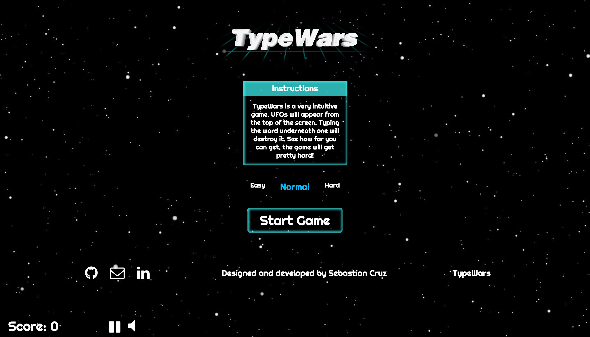
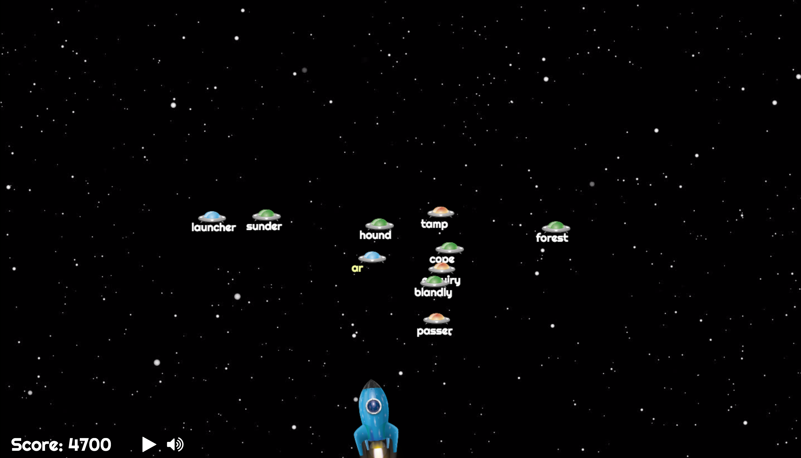
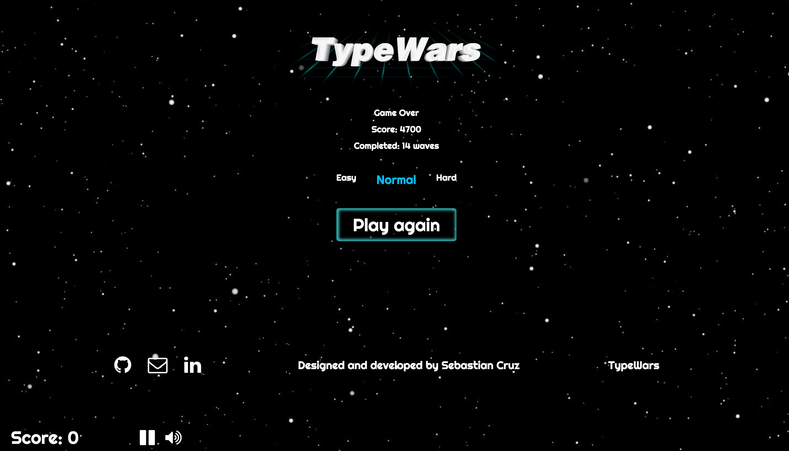

## Typewars

### GamePlay

TypeWars is a fairly intuitive game aimed at helping people sharpen their typing skills in a fun and interactive way. The player will have to type the words held by incoming enemy ships in order to destroy them. The game difficulty will progressively increase in word complexity, amount of enemies and spawn rate. Players will also be able to choose from 3 starting difficulties: Easy, Medium or Hard.

### Welcome Screen

TypeWars welcome screen is built solely on HTML and CSS. This was chosen over rendering in canvas because of the lower image quality canvas elements have. It has simple instructions, difficulty selector and links to the developers contact information.

### Waves

The game is separated through waves. Each incoming wave will be harder than the previous one. After finishing a wave a message will show and there will be a slight delay until the next incoming wave.

### Game Over

Once a player loses a Game Over screen will be displayed. This will allow players to change the difficulty setting and play again.

### Technology stack

- Vanilla JavaScript and `jQuery` for overall structure and game logic,
- `Easeljs` with `HTML5 Canvas` for DOM manipulation and rendering,
- `Soundjs` for music and sound effect,
- `Tweenjs` for better animations,
- Webpack to bundle and serve up the various scripts.

### Technical Implementation

- JavaScrip's Atan2 alongside a custom made algorithm was used to smoothly rotate the player ship to aim at the right enemy.
- Asynchronous callbacks and closures together with careful flow control were implemented to ensure timely deployment of sound effects and animations.
- Leveraged the use of the singleton pattern to enable a unique source of truth for single instance classes.
